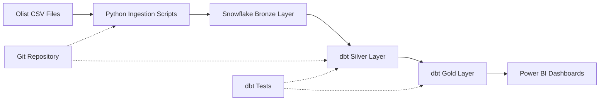

# Design Document: Olist ERP Analytics System

## Overview

The Olist ERP Analytics System is a comprehensive data pipeline implementing the Medallion Architecture (Bronze-Silver-Gold) to transform raw Brazilian e-commerce data into actionable business intelligence. The system consists of three major components:

1. **Data Ingestion Layer**: Python-based ETL scripts that load 9 CSV files from the Olist dataset into Snowflake's Bronze layer
2. **Transformation Layer**: dbt models that progressively clean, standardize, and model data through Silver (staging) and Gold (dimensional) layers
3. **Visualization Layer**: Power BI dashboards providing executive, operational, and vendor performance insights

The architecture follows modern data engineering best practices with separation of concerns, incremental processing, data quality testing, and version control.

## Architecture

### High-Level Architecture



### Medallion Architecture Layers

**Bronze Layer (Raw Data)**
- Purpose: Store unmodified source data
- Schema: `bronze` database in Snowflake
- Tables: Direct 1:1 mapping from CSV files with `bronze_` prefix
- Data Types: Inferred from CSV, primarily VARCHAR for flexibility
- No transformations applied

**Silver Layer (Staging)**
- Purpose: Cleaned, standardized, and typed data
- Schema: `silver` database in Snowflake
- Tables: Staging models with `stg_` prefix
- Transformations: Type casting, null handling, column renaming, deduplication
- Incremental processing where applicable

**Gold Layer (Analytics)**
- Purpose: Business-ready dimensional models
- Schema: `gold` database in Snowflake
- Tables: Fact tables (`fct_*`) and dimension tables (`dim_*`)
- Design: Star schema optimized for analytical queries
- Includes calculated metrics and aggregations

### Technology Stack

- **Data Warehouse**: Snowflake (cloud data platform)
- **Ingestion**: Python 3.9+ with `snowflake-connector-python`, `pandas`
- **Transformation**: dbt Core 1.5+ with `dbt-snowflake` adapter
- **Visualization**: Power BI Desktop/Service with DirectQuery
- **Version Control**: Git
- **Testing**: dbt tests (schema tests, data tests)
- **Documentation**: dbt docs

## Components and Interfaces

### 1. Data Ingestion System

**Purpose**: Load CSV files from local filesystem into Snowflake Bronze layer

**Components**:

```python
# config.py
class SnowflakeConfig:
    account: str
    user: str
    password: str
    warehouse: str
    database: str = "BRONZE"
    schema: str = "PUBLIC"
    role: str

# ingestion_engine.py
class CSVIngestionEngine:
    def __init__(self, config: SnowflakeConfig)
    def connect(self) -> snowflake.connector.Connection
    def create_table_from_csv(self, csv_path: str, table_name: str) -> int
    def infer_schema(self, df: pandas.DataFrame) -> dict
    def load_all_files(self, file_mapping: dict) -> dict
    def close(self)

# logger.py
class IngestionLogger:
    def log_start(self, file_name: str)
    def log_success(self, file_name: str, row_count: int)
    def log_error(self, file_name: str, error: Exception)
    def log_summary(self, results: dict)
```

**File Mapping**:
```python
FILE_MAPPING = {
    "olist_orders_dataset.csv": "bronze_orders",
    "olist_order_items_dataset.csv": "bronze_order_items",
    "olist_products_dataset.csv": "bronze_products",
    "olist_sellers_dataset.csv": "bronze_sellers",
    "olist_customers_dataset.csv": "bronze_customers",
    "olist_order_payments_dataset.csv": "bronze_order_payments",
    "olist_order_reviews_dataset.csv": "bronze_order_reviews",
    "olist_geolocation_dataset.csv": "bronze_geolocation",
    "product_category_name_translation.csv": "bronze_product_category_translation"
}
```

**Ingestion Algorithm**:
1. Read CSV file into pandas DataFrame
2. Infer Snowflake data types (default to VARCHAR for safety)
3. Generate CREATE TABLE statement
4. Execute CREATE TABLE in Snowflake
5. Use Snowflake's PUT command to stage file
6. Use COPY INTO to load data
7. Log row count and success/failure
8. Continue to next file (don't halt on single file failure)

**Error Handling**:
- Connection errors: Retry up to 3 times with exponential backoff
- File not found: Log error and skip file
- Data type errors: Log warning and use VARCHAR fallback
- Snowflake errors: Log full error message and continue

### 2. dbt Transformation System

**Purpose**: Transform Bronze data through Silver staging to Gold dimensional models

**Project Structure**:
```
dbt_olist_analytics/
├── dbt_project.yml
├── profiles.yml
├── models/
│   ├── staging/
│   │   ├── schema.yml
│   │   ├── stg_orders.sql
│   │   ├── stg_order_items.sql
│   │   ├── stg_products.sql
│   │   ├── stg_sellers.sql
│   │   ├── stg_customers.sql
│   │   ├── stg_order_payments.sql
│   │   ├── stg_order_reviews.sql
│   │   └── stg_geolocation.sql
│   ├── marts/
│   │   ├── schema.yml
│   │   ├── fct_b2b_sales.sql
│   │   ├── fct_logistics.sql
│   │   ├── dim_sellers.sql
│   │   ├── dim_products.sql
│   │   └── dim_customers.sql
│   └── snapshots/
│       └── order_status_snapshot.sql
├── tests/
│   └── assert_positive_revenue.sql
└── macros/
    └── generate_surrogate_key.sql
```

#### Silver Layer Models (Staging)

**stg_orders.sql**:
```sql
WITH source AS (
    SELECT * FROM {{ source('bronze', 'bronze_orders') }}
),

cleaned AS (
    SELECT
        order_id,
        customer_id,
        order_status,
        TRY_TO_TIMESTAMP(order_purchase_timestamp) AS order_purchase_timestamp,
        TRY_TO_TIMESTAMP(order_approved_at) AS order_approved_at,
        TRY_TO_TIMESTAMP(order_delivered_carrier_date) AS order_delivered_carrier_date,
        TRY_TO_TIMESTAMP(order_delivered_customer_date) AS order_delivered_customer_date,
        TRY_TO_TIMESTAMP(order_estimated_delivery_date) AS order_estimated_delivery_date
    FROM source
    WHERE order_id IS NOT NULL
)

SELECT * FROM cleaned
```

**stg_order_items.sql**:
```sql
WITH source AS (
    SELECT * FROM {{ source('bronze', 'bronze_order_items') }}
),

cleaned AS (
    SELECT
        order_id,
        order_item_id,
        product_id,
        seller_id,
        TRY_TO_TIMESTAMP(shipping_limit_date) AS shipping_limit_date,
        TRY_TO_NUMBER(price, 10, 2) AS price,
        TRY_TO_NUMBER(freight_value, 10, 2) AS freight_value
    FROM source
    WHERE order_id IS NOT NULL
      AND product_id IS NOT NULL
      AND seller_id IS NOT NULL
)

SELECT * FROM cleaned
```

**Common Staging Transformations**:
- Column name standardization (already snake_case in Olist)
- Type casting using TRY_TO_* functions (safe casting)
- Null filtering on primary/foreign keys
- Whitespace trimming on string columns
- Deduplication where necessary

#### Gold Layer Models (Dimensional)

**dim_products.sql**:
```sql
WITH products AS (
    SELECT * FROM {{ ref('stg_products') }}
),

categories AS (
    SELECT * FROM {{ source('bronze', 'bronze_product_category_translation') }}
),

product_metrics AS (
    SELECT
        product_id,
        COUNT(DISTINCT order_id) AS total_orders,
        SUM(price) AS total_revenue,
        AVG(price) AS avg_price
    FROM {{ ref('stg_order_items') }}
    GROUP BY product_id
)

SELECT
    {{ dbt_utils.generate_surrogate_key(['p.product_id']) }} AS product_key,
    p.product_id,
    p.product_category_name,
    COALESCE(c.product_category_name_english, 'Unknown') AS product_category_english,
    p.product_name_length,
    p.product_description_length,
    p.product_photos_qty,
    p.product_weight_g,
    p.product_length_cm,
    p.product_height_cm,
    p.product_width_cm,
    COALESCE(pm.total_orders, 0) AS total_orders,
    COALESCE(pm.total_revenue, 0) AS total_revenue,
    COALESCE(pm.avg_price, 0) AS avg_price
FROM products p
LEFT JOIN categories c
    ON p.product_category_name = c.product_category_name
LEFT JOIN product_metrics pm
    ON p.product_id = pm.product_id
```

**dim_sellers.sql**:
```sql
WITH sellers AS (
    SELECT * FROM {{ ref('stg_sellers') }}
),

seller_metrics AS (
    SELECT
        oi.seller_id,
        COUNT(DISTINCT oi.order_id) AS total_orders,
        SUM(oi.price + oi.freight_value) AS total_sales,
        AVG(oi.price) AS avg_order_value,
        AVG(r.review_score) AS avg_rating,
        COUNT(r.review_id) AS review_count
    FROM {{ ref('stg_order_items') }} oi
    LEFT JOIN {{ ref('stg_order_reviews') }} r
        ON oi.order_id = r.order_id
    GROUP BY oi.seller_id
)

SELECT
    {{ dbt_utils.generate_surrogate_key(['s.seller_id']) }} AS seller_key,
    s.seller_id,
    s.seller_zip_code_prefix,
    s.seller_city,
    s.seller_state,
    COALESCE(sm.total_orders, 0) AS total_orders,
    COALESCE(sm.total_sales, 0) AS total_sales,
    COALESCE(sm.avg_order_value, 0) AS avg_order_value,
    COALESCE(sm.avg_rating, 0) AS avg_rating,
    COALESCE(sm.review_count, 0) AS review_count
FROM sellers s
LEFT JOIN seller_metrics sm
    ON s.seller_id = sm.seller_id
```

**dim_customers.sql**:
```sql
WITH customers AS (
    SELECT * FROM {{ ref('stg_customers') }}
),

customer_metrics AS (
    SELECT
        customer_id,
        COUNT(DISTINCT order_id) AS total_orders,
        MIN(order_purchase_timestamp) AS first_order_date,
        MAX(order_purchase_timestamp) AS last_order_date
    FROM {{ ref('stg_orders') }}
    GROUP BY customer_id
)

SELECT
    {{ dbt_utils.generate_surrogate_key(['c.customer_id']) }} AS customer_key,
    c.customer_id,
    c.customer_unique_id,
    c.customer_zip_code_prefix,
    c.customer_city,
    c.customer_state,
    COALESCE(cm.total_orders, 0) AS total_orders,
    cm.first_order_date,
    cm.last_order_date
FROM customers c
LEFT JOIN customer_metrics cm
    ON c.customer_id = cm.customer_id
```

**fct_b2b_sales.sql**:
```sql
WITH orders AS (
    SELECT * FROM {{ ref('stg_orders') }}
),

order_items AS (
    SELECT * FROM {{ ref('stg_order_items') }}
),

payments AS (
    SELECT
        order_id,
        SUM(payment_value) AS total_payment_value,
        LISTAGG(DISTINCT payment_type, ', ') AS payment_types
    FROM {{ ref('stg_order_payments') }}
    GROUP BY order_id
)

SELECT
    {{ dbt_utils.generate_surrogate_key(['oi.order_id', 'oi.order_item_id']) }} AS sales_key,
    oi.order_id,
    oi.order_item_id,
    oi.product_id,
    oi.seller_id,
    o.customer_id,
    o.order_purchase_timestamp,
    o.order_approved_at,
    o.order_status,
    oi.price,
    oi.freight_value,
    oi.price + oi.freight_value AS total_item_value,
    p.total_payment_value,
    p.payment_types,
    oi.shipping_limit_date
FROM order_items oi
INNER JOIN orders o
    ON oi.order_id = o.order_id
LEFT JOIN payments p
    ON oi.order_id = p.order_id
```

**fct_logistics.sql**:
```sql
WITH orders AS (
    SELECT * FROM {{ ref('stg_orders') }}
),

order_items AS (
    SELECT
        order_id,
        SUM(freight_value) AS total_freight_value,
        MIN(shipping_limit_date) AS earliest_shipping_limit
    FROM {{ ref('stg_order_items') }}
    GROUP BY order_id
)

SELECT
    {{ dbt_utils.generate_surrogate_key(['o.order_id']) }} AS logistics_key,
    o.order_id,
    o.customer_id,
    o.order_purchase_timestamp,
    o.order_approved_at,
    o.order_delivered_carrier_date,
    o.order_delivered_customer_date,
    o.order_estimated_delivery_date,
    oi.earliest_shipping_limit,
    oi.total_freight_value,
    DATEDIFF(day, o.order_approved_at, o.order_delivered_carrier_date) AS handling_time_days,
    DATEDIFF(day, o.order_delivered_carrier_date, o.order_delivered_customer_date) AS shipping_time_days,
    DATEDIFF(day, o.order_purchase_timestamp, o.order_delivered_customer_date) AS total_delivery_time_days,
    DATEDIFF(day, o.order_purchase_timestamp, o.order_estimated_delivery_date) AS estimated_delivery_time_days,
    CASE
        WHEN o.order_delivered_customer_date <= o.order_estimated_delivery_date THEN 1
        ELSE 0
    END AS is_on_time_delivery
FROM orders o
LEFT JOIN order_items oi
    ON o.order_id = oi.order_id
WHERE o.order_status = 'delivered'
```

#### Snapshots (SCD Type 2)

**order_status_snapshot.sql**:
```sql


{{
    config(
      target_schema='snapshots',
      unique_key='order_id',
      strategy='check',
      check_cols=['order_status'],
    )
}}

SELECT
    order_id,
    order_status,
    order_purchase_timestamp,
    order_approved_at,
    order_delivered_carrier_date,
    order_delivered_customer_date
FROM {{ ref('stg_orders') }}


```

**Snapshot Behavior**:
- Tracks changes to `order_status` field
- Creates new row when status changes
- Adds metadata columns: `dbt_valid_from`, `dbt_valid_to`, `dbt_updated_at`, `dbt_scd_id`
- Sets `dbt_valid_to` to NULL for current record

### 3. Data Quality Testing System

**Schema Tests (schema.yml)**:
```yaml
version: 2

models:
  - name: dim_products
    description: "Product dimension with category translations and metrics"
    columns:
      - name: product_key
        description: "Surrogate key for product dimension"
        tests:
          - unique
          - not_null
      - name: product_id
        description: "Natural key from source system"
        tests:
          - unique
          - not_null
      - name: total_revenue
        description: "Total revenue generated by this product"
        tests:
          - not_null

  - name: dim_sellers
    description: "Seller dimension with performance metrics"
    columns:
      - name: seller_key
        tests:
          - unique
          - not_null
      - name: seller_id
        tests:
          - unique
          - not_null
      - name: avg_rating
        tests:
          - dbt_utils.accepted_range:
              min_value: 0
              max_value: 5

  - name: fct_b2b_sales
    description: "Sales fact table with order line items"
    columns:
      - name: sales_key
        tests:
          - unique
          - not_null
      - name: order_id
        tests:
          - not_null
          - relationships:
              to: ref('stg_orders')
              field: order_id
      - name: product_id
        tests:
          - not_null
          - relationships:
              to: ref('dim_products')
              field: product_id
      - name: seller_id
        tests:
          - not_null
          - relationships:
              to: ref('dim_sellers')
              field: seller_id
      - name: price
        tests:
          - not_null
          - dbt_utils.accepted_range:
              min_value: 0
```

**Custom Data Tests (tests/assert_positive_revenue.sql)**:
```sql
-- Test that all revenue calculations are non-negative
SELECT
    order_id,
    total_item_value
FROM {{ ref('fct_b2b_sales') }}
WHERE total_item_value < 0
```

### 4. Power BI Visualization System

**Connection Configuration**:
- Connection Type: DirectQuery to Snowflake
- Authentication: Service Account with read-only access to Gold schema
- Refresh: Real-time (DirectQuery eliminates need for scheduled refresh)

**Data Model in Power BI**:
```
fct_b2b_sales (Fact)
├── dim_products (1:Many)
├── dim_sellers (1:Many)
├── dim_customers (1:Many)
└── Date Table (1:Many on order_purchase_timestamp)

fct_logistics (Fact)
├── dim_customers (1:Many)
└── Date Table (1:Many on order_purchase_timestamp)
```

**DAX Measures**:

```dax
// Executive Dashboard Measures
Total Revenue = SUM(fct_b2b_sales[total_item_value])

Total Orders = DISTINCTCOUNT(fct_b2b_sales[order_id])

Average Order Value = DIVIDE([Total Revenue], [Total Orders], 0)

Revenue YoY Growth = 
VAR CurrentYearRevenue = [Total Revenue]
VAR PreviousYearRevenue = CALCULATE([Total Revenue], SAMEPERIODLASTYEAR('Date'[Date]))
RETURN DIVIDE(CurrentYearRevenue - PreviousYearRevenue, PreviousYearRevenue, 0)

// Supply Chain Dashboard Measures
Delivery Accuracy % = 
VAR OnTimeDeliveries = CALCULATE(COUNT(fct_logistics[logistics_key]), fct_logistics[is_on_time_delivery] = 1)
VAR TotalDeliveries = COUNT(fct_logistics[logistics_key])
RETURN DIVIDE(OnTimeDeliveries, TotalDeliveries, 0) * 100

Average Handling Time = AVERAGE(fct_logistics[handling_time_days])

Average Shipping Cost = AVERAGE(fct_logistics[total_freight_value])

Late Deliveries = CALCULATE(COUNT(fct_logistics[logistics_key]), fct_logistics[is_on_time_delivery] = 0)

// Vendor Performance Measures
Seller SLA Compliance % = 
VAR CompliantOrders = CALCULATE(COUNT(fct_b2b_sales[sales_key]), fct_logistics[is_on_time_delivery] = 1)
VAR TotalOrders = COUNT(fct_b2b_sales[sales_key])
RETURN DIVIDE(CompliantOrders, TotalOrders, 0) * 100

Average Customer Satisfaction = AVERAGE(dim_sellers[avg_rating])
```

**Dashboard Layouts**:

1. **Executive Sales Overview**:
   - Top Row: 4 KPI cards (Total Revenue, Total Orders, AOV, YoY Growth)
   - Second Row: Line chart (Revenue Trend), Map (Revenue by State)
   - Third Row: Bar chart (Revenue by Category), Table (Top 10 Products)

2. **Supply Chain War Room**:
   - Top Row: 3 KPI cards (Delivery Accuracy %, Avg Handling Time, Avg Shipping Cost)
   - Second Row: Histogram (Delivery Time Distribution), Scatter plot (Handling vs Shipping Cost)
   - Third Row: Table (Late Deliveries), Line chart (Delivery Accuracy Trend)

3. **B2B Vendor Performance**:
   - Top Row: 3 KPI cards (Total Sellers, Avg SLA Compliance %, Avg Customer Satisfaction)
   - Second Row: Table (Seller Leaderboard), Bar chart (Performance by Category)
   - Third Row: Scatter plot (Revenue vs Rating), Table (SLA Violations)

## Data Models

### Bronze Layer Schema

All Bronze tables use VARCHAR for maximum flexibility during ingestion:

```sql
CREATE TABLE bronze_orders (
    order_id VARCHAR,
    customer_id VARCHAR,
    order_status VARCHAR,
    order_purchase_timestamp VARCHAR,
    order_approved_at VARCHAR,
    order_delivered_carrier_date VARCHAR,
    order_delivered_customer_date VARCHAR,
    order_estimated_delivery_date VARCHAR
);

CREATE TABLE bronze_order_items (
    order_id VARCHAR,
    order_item_id VARCHAR,
    product_id VARCHAR,
    seller_id VARCHAR,
    shipping_limit_date VARCHAR,
    price VARCHAR,
    freight_value VARCHAR
);

-- Similar structure for other 7 tables
```

### Silver Layer Schema

Staging tables with proper types:

```sql
CREATE TABLE stg_orders (
    order_id VARCHAR PRIMARY KEY,
    customer_id VARCHAR NOT NULL,
    order_status VARCHAR NOT NULL,
    order_purchase_timestamp TIMESTAMP,
    order_approved_at TIMESTAMP,
    order_delivered_carrier_date TIMESTAMP,
    order_delivered_customer_date TIMESTAMP,
    order_estimated_delivery_date TIMESTAMP
);

CREATE TABLE stg_order_items (
    order_id VARCHAR NOT NULL,
    order_item_id INTEGER NOT NULL,
    product_id VARCHAR NOT NULL,
    seller_id VARCHAR NOT NULL,
    shipping_limit_date TIMESTAMP,
    price DECIMAL(10,2) NOT NULL,
    freight_value DECIMAL(10,2) NOT NULL,
    PRIMARY KEY (order_id, order_item_id)
);
```

### Gold Layer Schema

Dimensional model with surrogate keys:

```sql
CREATE TABLE dim_products (
    product_key VARCHAR PRIMARY KEY,  -- Surrogate key
    product_id VARCHAR UNIQUE NOT NULL,  -- Natural key
    product_category_name VARCHAR,
    product_category_english VARCHAR,
    product_name_length INTEGER,
    product_description_length INTEGER,
    product_photos_qty INTEGER,
    product_weight_g INTEGER,
    product_length_cm INTEGER,
    product_height_cm INTEGER,
    product_width_cm INTEGER,
    total_orders INTEGER,
    total_revenue DECIMAL(12,2),
    avg_price DECIMAL(10,2)
);

CREATE TABLE dim_sellers (
    seller_key VARCHAR PRIMARY KEY,
    seller_id VARCHAR UNIQUE NOT NULL,
    seller_zip_code_prefix VARCHAR,
    seller_city VARCHAR,
    seller_state VARCHAR,
    total_orders INTEGER,
    total_sales DECIMAL(12,2),
    avg_order_value DECIMAL(10,2),
    avg_rating DECIMAL(3,2),
    review_count INTEGER
);

CREATE TABLE dim_customers (
    customer_key VARCHAR PRIMARY KEY,
    customer_id VARCHAR UNIQUE NOT NULL,
    customer_unique_id VARCHAR,
    customer_zip_code_prefix VARCHAR,
    customer_city VARCHAR,
    customer_state VARCHAR,
    total_orders INTEGER,
    first_order_date TIMESTAMP,
    last_order_date TIMESTAMP
);

CREATE TABLE fct_b2b_sales (
    sales_key VARCHAR PRIMARY KEY,
    order_id VARCHAR NOT NULL,
    order_item_id INTEGER NOT NULL,
    product_id VARCHAR NOT NULL,
    seller_id VARCHAR NOT NULL,
    customer_id VARCHAR NOT NULL,
    order_purchase_timestamp TIMESTAMP,
    order_approved_at TIMESTAMP,
    order_status VARCHAR,
    price DECIMAL(10,2),
    freight_value DECIMAL(10,2),
    total_item_value DECIMAL(10,2),
    total_payment_value DECIMAL(10,2),
    payment_types VARCHAR,
    shipping_limit_date TIMESTAMP
);

CREATE TABLE fct_logistics (
    logistics_key VARCHAR PRIMARY KEY,
    order_id VARCHAR NOT NULL,
    customer_id VARCHAR NOT NULL,
    order_purchase_timestamp TIMESTAMP,
    order_approved_at TIMESTAMP,
    order_delivered_carrier_date TIMESTAMP,
    order_delivered_customer_date TIMESTAMP,
    order_estimated_delivery_date TIMESTAMP,
    earliest_shipping_limit TIMESTAMP,
    total_freight_value DECIMAL(10,2),
    handling_time_days INTEGER,
    shipping_time_days INTEGER,
    total_delivery_time_days INTEGER,
    estimated_delivery_time_days INTEGER,
    is_on_time_delivery INTEGER
);
```


## Correctness Properties

*A property is a characteristic or behavior that should hold true across all valid executions of a system—essentially, a formal statement about what the system should do. Properties serve as the bridge between human-readable specifications and machine-verifiable correctness guarantees.*

### Data Ingestion Properties

**Property 1: CSV File to Table Mapping**
*For any* CSV file in the Olist dataset, when processed by the Ingestion_System, a corresponding Bronze layer table should be created in Snowflake with the expected table name.
**Validates: Requirements 1.1, 1.2, 1.3, 1.4, 1.5, 1.6, 1.7, 1.8, 1.9**

**Property 2: Column Preservation**
*For any* CSV file loaded into the Bronze layer, all original columns from the source file should be present in the resulting Snowflake table with matching column names.
**Validates: Requirements 1.10**

**Property 3: Ingestion Error Logging**
*For any* CSV file that fails to load, the error log should contain the file name and specific error details.
**Validates: Requirements 1.11**

**Property 4: Row Count Reporting**
*For any* successful ingestion run, the system output should include row counts for all successfully loaded tables.
**Validates: Requirements 1.12**

**Property 5: Ingestion Resilience**
*For any* set of CSV files where one file fails to load, the Ingestion_System should continue processing the remaining files and report results for all files.
**Validates: Requirements 12.5**

### Silver Layer Transformation Properties

**Property 6: Staging Table Naming Convention**
*For any* staging table created in the Silver layer, the table name should start with the prefix "stg_".
**Validates: Requirements 2.6**

**Property 7: Column Name Standardization**
*For any* staging table, all column names should follow snake_case naming convention (lowercase with underscores).
**Validates: Requirements 2.1**

**Property 8: Date Type Casting**
*For any* column in staging tables that represents a date or timestamp, the column should have a TIMESTAMP or DATE data type (not VARCHAR).
**Validates: Requirements 2.3**

**Property 9: Numeric Type Casting**
*For any* column in staging tables that represents a numeric value (price, quantity, etc.), the column should have a numeric data type (DECIMAL, INTEGER, FLOAT) not VARCHAR.
**Validates: Requirements 2.4**

**Property 10: String Whitespace Handling**
*For any* string value in staging tables, leading and trailing whitespace should be removed compared to the Bronze layer source.
**Validates: Requirements 2.5**

### Gold Layer Dimensional Model Properties

**Property 11: Surrogate Key Presence**
*For any* dimension table in the Gold layer, the table should have a surrogate key column as its primary key (e.g., product_key, seller_key, customer_key).
**Validates: Requirements 3.7**

**Property 12: Foreign Key Presence in Fact Tables**
*For any* fact table in the Gold layer, the table should include foreign key columns referencing all relevant dimension tables.
**Validates: Requirements 3.6**

**Property 13: Referential Integrity**
*For any* foreign key value in a fact table, there should exist a matching primary key value in the referenced dimension table.
**Validates: Requirements 4.2, 4.3, 4.4, 4.5, 4.6, 6.3**

**Property 14: Primary Key Uniqueness**
*For any* dimension table, all values in the primary key column should be unique (no duplicates).
**Validates: Requirements 4.7, 6.1**

**Property 15: Primary Key Not Null**
*For any* dimension table, all values in the primary key column should be non-null.
**Validates: Requirements 4.8, 6.2**

### Slowly Changing Dimension Properties

**Property 16: SCD Type 2 Record Creation**
*For any* order where the order_status changes, a new snapshot record should be created with the updated status while preserving the previous record.
**Validates: Requirements 5.1**

**Property 17: SCD Current Record Uniqueness**
*For any* order_id in the snapshot table, exactly one record should have is_current flag set to TRUE.
**Validates: Requirements 5.7**

**Property 18: SCD Temporal Validity**
*For any* snapshot record with is_current = TRUE, the dbt_valid_to field should be NULL, and for records with is_current = FALSE, dbt_valid_to should be non-null.
**Validates: Requirements 5.2, 5.3, 5.4, 5.5**

### Data Quality Properties

**Property 19: Date Field Validity**
*For any* date or timestamp column in Silver or Gold layers, all non-null values should be valid dates (parseable as TIMESTAMP or DATE).
**Validates: Requirements 6.4**

**Property 20: Numeric Field Validity**
*For any* numeric column in Silver or Gold layers, all non-null values should be valid numbers (not strings or special characters).
**Validates: Requirements 6.5**

**Property 21: Revenue Non-Negativity**
*For any* revenue or price calculation in fact tables (price, freight_value, total_item_value, total_sales), the value should be greater than or equal to zero.
**Validates: Requirements 6.6**

**Property 22: Order Status Domain Validation**
*For any* order_status value in the orders table, the value should be from the accepted list: ['delivered', 'shipped', 'processing', 'canceled', 'unavailable', 'invoiced', 'approved', 'created'].
**Validates: Requirements 6.7**

**Property 23: Payment Type Domain Validation**
*For any* payment_type value in the payments table, the value should be from the accepted list: ['credit_card', 'boleto', 'voucher', 'debit_card'].
**Validates: Requirements 6.8**

**Property 24: Test Failure Reporting**
*For any* data quality test that fails, the error output should include the test name, table name, and count of failing records.
**Validates: Requirements 6.9**

### Error Handling Properties

**Property 25: Connection Error Retry**
*For any* connection error encountered during ingestion, the system should log the error with timestamp and attempt to retry the connection before failing.
**Validates: Requirements 12.1**

**Property 26: Error Message Completeness**
*For any* error encountered during ingestion or transformation, the error log should include contextual information (file name, table name, model name, column name, or row number as applicable).
**Validates: Requirements 12.2, 12.3, 12.4**

**Property 27: dbt Model Failure Handling**
*For any* dbt model that fails during execution, the dbt run should halt and report all failed models (not continue to dependent models).
**Validates: Requirements 12.6**

### Documentation Properties

**Property 28: Model Documentation Completeness**
*For any* dbt model in Silver or Gold layers, the generated documentation should include column descriptions for all columns in that model.
**Validates: Requirements 11.2**

## Error Handling

### Ingestion Layer Error Handling

**Connection Errors**:
- Implement exponential backoff retry (3 attempts: 1s, 2s, 4s delays)
- Log each retry attempt with timestamp
- Fail gracefully after max retries with clear error message
- Continue to next file if one file's connection fails

**File Errors**:
- File not found: Log error, skip file, continue processing
- Invalid CSV format: Log error with line number, skip file
- Empty file: Log warning, create empty table, continue

**Data Type Errors**:
- Use VARCHAR as fallback for type inference failures
- Log warning with column name and sample problematic value
- Continue loading with VARCHAR type

**Snowflake Errors**:
- Capture full Snowflake error message
- Log error with SQL statement that failed
- Rollback transaction for failed file
- Continue to next file

### Transformation Layer Error Handling

**Model Compilation Errors**:
- dbt will halt on compilation errors (syntax errors in SQL)
- Error message includes model name and line number
- No partial execution

**Model Execution Errors**:
- dbt will halt on execution errors (runtime SQL errors)
- Error message includes model name and SQL error
- Dependent models will not execute

**Test Failures**:
- dbt tests run after models complete
- Test failures are reported but don't halt execution by default
- Use `--fail-fast` flag to halt on first test failure
- Each test failure includes test name, model name, and failure count

**Snapshot Errors**:
- Snapshot failures halt execution
- Error includes snapshot name and SQL error
- Previous snapshot state is preserved

### Visualization Layer Error Handling

**Connection Errors**:
- Power BI will display connection error message
- Retry connection manually
- Check Snowflake credentials and network

**Query Errors**:
- DirectQuery errors display in visual
- Check SQL generated by Power BI
- Verify table and column names match Snowflake schema

**Data Refresh Errors**:
- Not applicable for DirectQuery (real-time)
- For Import mode (if used), refresh errors logged in Power BI service

## Testing Strategy

### Dual Testing Approach

This project requires both unit tests and property-based tests to ensure comprehensive coverage:

**Unit Tests**: Verify specific examples, edge cases, and integration points
- Test specific file ingestion scenarios (e.g., orders.csv → bronze_orders)
- Test specific dbt model outputs with known input data
- Test specific DAX measure calculations with sample data
- Test error handling with specific invalid inputs
- Test configuration and setup (e.g., connection strings, credentials)

**Property-Based Tests**: Verify universal properties across all inputs
- Test that all CSV files map to correct table names (Property 1)
- Test that all staging tables follow naming conventions (Property 6, 7)
- Test that all dimension tables have surrogate keys (Property 11)
- Test referential integrity across all fact-dimension relationships (Property 13)
- Test data quality rules across all records (Properties 19-23)

Both testing approaches are complementary and necessary. Unit tests catch specific bugs and validate concrete examples, while property-based tests verify that rules hold universally across the entire dataset.

### Testing Framework Selection

**Python Ingestion Tests**:
- Unit testing: `pytest` for Python unit tests
- Property-based testing: `hypothesis` for Python property tests
- Mocking: `pytest-mock` for Snowflake connection mocking
- Coverage: `pytest-cov` for code coverage reporting

**dbt Transformation Tests**:
- Built-in dbt tests: schema tests (unique, not_null, relationships, accepted_values)
- Custom data tests: SQL-based tests in `tests/` directory
- dbt test configuration: Run with `dbt test` command
- Property validation: Use dbt tests to validate properties 11-24

**Power BI Tests**:
- DAX measure validation: Manual testing with known datasets
- Visual validation: Manual review of dashboard layouts
- Performance testing: Query performance monitoring in Snowflake

### Property-Based Test Configuration

**Hypothesis Configuration for Python**:
```python
from hypothesis import given, settings, strategies as st

# Configure to run minimum 100 iterations per test
@settings(max_examples=100)
@given(csv_file=st.sampled_from(FILE_MAPPING.keys()))
def test_csv_to_table_mapping(csv_file):
    """
    Feature: olist-erp-analytics, Property 1: CSV File to Table Mapping
    For any CSV file in the Olist dataset, when processed by the Ingestion_System,
    a corresponding Bronze layer table should be created in Snowflake.
    """
    # Test implementation
    pass
```

**dbt Test Configuration**:
```yaml
# Configure dbt tests to validate properties
tests:
  - name: test_surrogate_keys_exist
    description: "Property 11: All dimension tables have surrogate keys"
    config:
      severity: error
      
  - name: test_referential_integrity
    description: "Property 13: All foreign keys reference existing dimension records"
    config:
      severity: error
```

### Test Coverage Requirements

**Ingestion Layer**:
- Unit tests for each of the 9 CSV files
- Property tests for column preservation (Property 2)
- Property tests for error handling (Properties 3, 5, 25, 26)
- Edge case tests: empty files, malformed CSV, special characters

**Transformation Layer**:
- dbt schema tests for all models (unique, not_null, relationships)
- dbt data tests for business rules (Properties 19-23)
- Property tests for naming conventions (Properties 6, 7)
- Property tests for SCD Type 2 behavior (Properties 16-18)
- Integration tests for full pipeline (Bronze → Silver → Gold)

**Visualization Layer**:
- Manual testing of all 3 dashboards
- DAX measure validation with sample data
- Performance testing with full dataset
- Cross-filter testing

### Continuous Integration

**Recommended CI/CD Pipeline**:
1. **Code Commit**: Push to Git repository
2. **Python Tests**: Run pytest with hypothesis tests
3. **dbt Compile**: Validate SQL compilation
4. **dbt Run**: Execute transformations in dev environment
5. **dbt Test**: Run all data quality tests
6. **dbt Docs**: Generate and publish documentation
7. **Deployment**: Promote to production on success

**Test Execution Order**:
1. Python unit tests (fast feedback)
2. Python property tests (comprehensive validation)
3. dbt compilation tests (syntax validation)
4. dbt model execution (transformation validation)
5. dbt data quality tests (business rule validation)
6. Integration tests (end-to-end validation)

### Test Data Strategy

**Development Environment**:
- Use subset of Olist data (e.g., 1000 orders) for fast iteration
- Include edge cases: null values, special characters, boundary dates
- Maintain referential integrity in test data

**Staging Environment**:
- Use full Olist dataset for realistic testing
- Run full test suite including property-based tests
- Validate performance with production-scale data

**Production Environment**:
- Run dbt tests on schedule (daily or after each load)
- Monitor test results and alert on failures
- Maintain test result history for trend analysis
